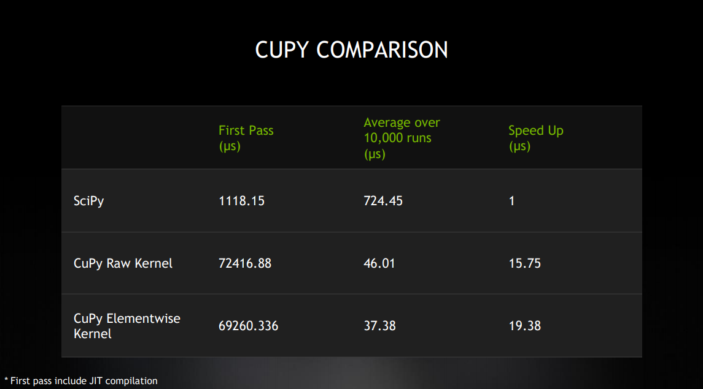

# GTC Spring 2021
## [GPU Acceleration in Python Using Elementwise Kernels](https://gtc21.event.nvidia.com/media/1_1mq80cv8) 

Use this repository to parallelize operations on the GPU by using Elementwise Kernel functions from the CuPy API. Definitions of Elementwise Kernels follow a distinct template with four essential parameters and their goal is to provide elementwise operations that target the NVIDIA GPU without the need of CUDA code. The benefit of Elementwise Kernel functions will be shown through the comparison of serial Python, Elementwise Kernel functions, and CuPy’s Raw Kernels performing the same functionality. Raw Kernels are a user-defined kernel using raw CUDA source. Performance analysis can be done using NVIDIA’s Nsight Systems system-wide profiler.

## Results on Quadro RTX 6000

